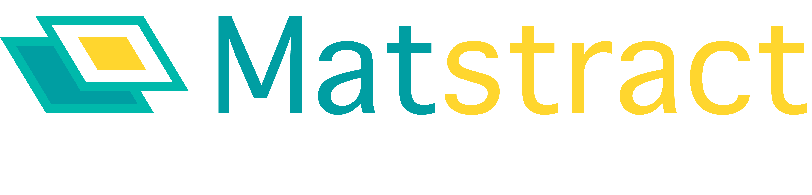

Publications on this project are being prepared. Please do not fork this repository or otherwise use it's code or other intellectual property until citable publications are available. 

Using NLP to extract materials data from the abstracts of scientific journal articles. 

# Contributors

@jdagdelen, @vtshitoyan, @lweston
